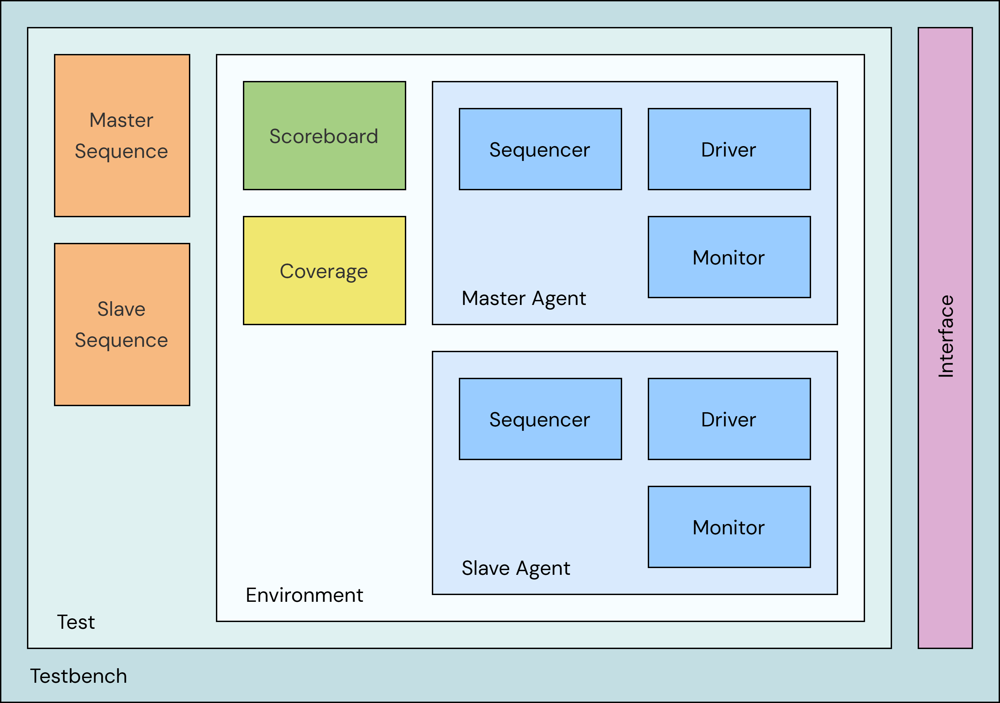

# AMBA 3 AHB-Lite VIP

SystemVerilog/UVM verification IP for the AMBA 3 AHB-Lite protocol (ARM IHI0033A).

## Architecture

- **Test** (`ahb_base_test` and derived tests): builds `ahb_vip_env_config`, sets agent options, and starts master sequences and, when needed, slave sequences.
- **Environment** (`ahb_vip_env`): one master agent, one slave agent, a scoreboard and one coverage collector per agent. The scoreboard and coverage can be disabled through the config.
- **Agents**: sequencer, driver and monitor in active mode; monitor only in passive mode. Each monitor feeds the scoreboard and its agent's coverage collector.
- **Interface** (`ahb_if`): separate clocking blocks and modports for the master driver, slave driver and monitors. By default both agents share one interface (passthrough). `tb_top` connects the interface signals to the SVA checker `ahb_sva`.

<p align="center">
  
</p>

## Features

**Master agent** (driver / sequencer / monitor)
- Bursts: SINGLE, INCR, INCR4/8/16, WRAP4/8/16. HSIZE: 8/16/32 bit.
- BUSY insertion between beats; burst cancellation on ERROR.
- Back-to-back: the next transaction's address phase overlaps the last data phase of the current one (`en_back_to_back`).
- Optional IDLE-to-NONSEQ change during a wait state (`en_idle_to_nonseq_in_wait`).
- Outstanding transaction limit (`max_outstanding`).
- Monitor reconstructs bursts from the pipelined bus and publishes on two analysis ports: `ap` (completed transactions) and `trans_ap` (HTRANS per address phase, IDLE included).

**Slave agent**
- `auto_gen_resp = 1`: internal memory model, OKAY responses, random wait states in `[ready_delay_min, ready_delay_max]`.
- `auto_gen_resp = 0`: per-beat wait states, HRESP and HRDATA from `ahb_slave_response` sequence items. ERROR is driven as the two-cycle response.

**Checking**
- Scoreboard:
  1. In-order comparison of master and slave monitor streams.
  2. Byte-addressable reference memory: WRITE stores, READ checks against the last write. OKAY beats only; reads of unwritten locations are skipped and counted.
- SVA ([src/sva/ahb_sva.sv](src/sva/ahb_sva.sv)): 31 assertions (X/Z, wait-state stability, alignment, 1KB boundary, burst/BUSY/IDLE rules, INCR/WRAP addressing, two-cycle ERROR, reset) and 7 cover properties for HTRANS changes during wait states.
- Coverage: `ahb_cg` (direction, burst, size, beat count, response, BUSY, wait states, crosses) sampled per transaction; `ahb_trans_cg` samples HTRANS per bus cycle. One instance per agent.

## Directory structure

```
src/
  ahb_if.sv            interface, clocking blocks and modports (master, slave, monitor)
  ahb_pkg.sv           VIP package (cfg/, mst/, slv/, env/)
  ahb_seq_pkg.sv       sequence library (mst_seq/, slv_seq/)
  ahb_test_pkg.sv      tests (test/)
  sva/ahb_sva.sv       assertion module, instantiated in tb_top
  tb_top.sv            100 MHz clock, reset, watchdog, run_test()
sim/
  Makefile             QuestaSim flow: compile, run, regress, coverage
  wave.do              waveform setup for GUI mode
  report/              logs, UCDBs and HTML coverage from the latest regression
doc/
  ahb_lite_vplan.xlsx  verification plan
  ahb_lite_vip.png     architecture diagram
```

## Running

Requires QuestaSim with bundled UVM and a POSIX shell (Linux, or Git Bash/MSYS on Windows). Tested with QuestaSim 10.6b + UVM-1.1d.

```sh
cd sim
make run TESTNAME=ahb_sanity_test SEED=42     # single test
make gui TESTNAME=ahb_wrap_burst_test         # GUI with wave.do
make -j8 regress NUM_RUNS=5                   # parallel regression, random seeds
make cov_report                               # merge UCDBs -> report/cov_html/index.html
make help                                     # list targets and variables
```

Main variables: `TESTNAME`, `SEED` (integer or `random`), `UVM_VERBOSITY`, `NUM_RUNS`, `USE_COVERAGE` (0/1), `TEST_LIST`, `PLUSARGS`. Testbench plusargs: `+DUMP_VCD` (enabled by default in the Makefile), `+TIMEOUT_NS=<ns>` (default 10 ms).

A regression run is marked FAILED if its log reports a non-zero `UVM_ERROR` or `UVM_FATAL` count.

## Limitations

- No DUT. The testbench runs in passthrough mode: master and slave agents share one `ahb_if`, so the VIP is checked against its own slave model. `ahb_vip_env_config.slave_vif` allows separate master/slave buses for a DUT in between, but no test uses it yet.
- Single master, single slave. No HSEL, no decoder/multiplexer; HREADY and HREADYOUT are one signal.
- Fixed 32-bit address / 32-bit data (`AHB_ADDR_WIDTH`, `AHB_DATA_WIDTH` in [src/cfg/ahb_types.sv](src/cfg/ahb_types.sv)); other widths are untested.
- HPROT is not supported (constrained to `AHB_PROT_DEFAULT`); HMASTLOCK is fixed to 0 (single master). SVA still checks both for stability.
- Only run on QuestaSim 10.6b / UVM-1.1d.

## AI Disclaimer

This codebase was developed and refactored with the assistance of AI tools, used for boilerplate scaffolding and testbench optimization. All logic, test suites, and simulation configurations have been reviewed and validated against the AMBA 3 AHB-Lite specification.